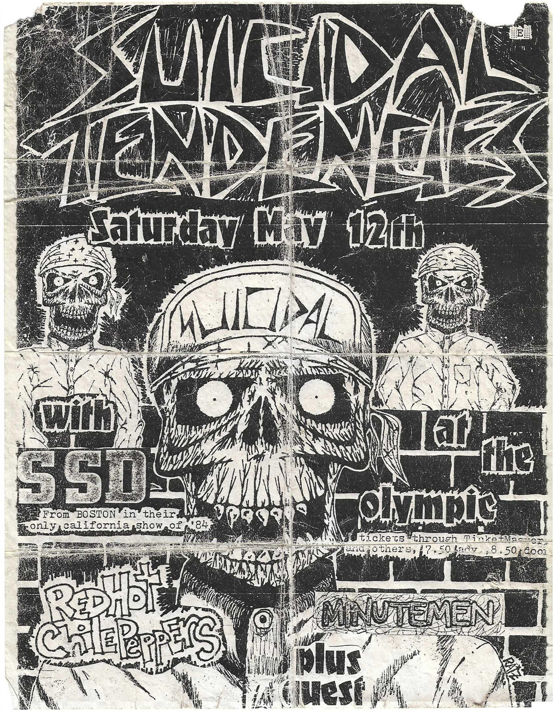

# Info

## Setlist

## Notes

**Other Acts**: -

> Anthony was not present at this show. Flea mentions it on the official ["An Oral/Visual History"](https://en.wikipedia.org/wiki/An_Oral/Visual_History_by_the_Red_Hot_Chili_Peppers) book (p. 147):
*"We got an opening slot at the Olympic Auditorium. But Anthony in all his junkie splendor did not show up. Keith Morris from the Circle Jerks said "I'll sing" and so we went out with him. We were just playing the songs and he would yell out stuff - whatever he could."*

**Headliner**: Suicidal Tendencies, SS Decontrol

## Media 

  
Pictures

  
  
  

## Line Up

* Anthony Kiedis
* Flea
* Jack Sherman
* Cliff Martinez

## Recordings

## Links