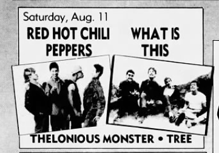
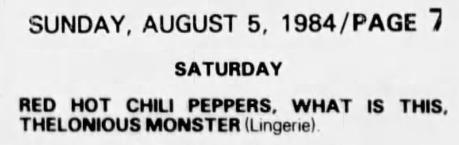

# Info

## Setlist

1. Out in L.A.
2. Buckle Down
3. Battleship
4. Green Heaven
5. Sex Rap
6. Why Don't You Love Me (Hank Williams)
7. Baby Appeal
8. True Men Don't Kill Coyotes
9. Blackeyed Blonde
10. Get Up and Jump
 ENCORE BREAK
11. Fire (Jimi Hendrix)

## Notes

> :star: Hillel Slovak and Jack Irons reunited with the band for the first time since late 1983 for the encore.
Setlist is probably missing a few songs. :star:

**Other Acts**: [What Is This](https://en.wikipedia.org/wiki/What_Is_This%3F), [Thelonious Monster](https://en.wikipedia.org/wiki/Thelonious_Monster)

## Media 

  
Pictures

  
  

## Line Up

* Anthony Kiedis
* Flea
* Jack Sherman
* Cliff Martinez

## Recordings

* SBD #1 soundboard audio soundboard > unknown ANA(X) > FLAC Missing all the banter between songs. "Green Heaven" cuts out, so it might also be missing a few songs before "Sex Rap".

## Links

* [Club Lingerie (Rock & Roll Roadmaps)](https://rockandrollroadmap.com/places/where-they-played/los-angeles-area-venues/club-lingerie)