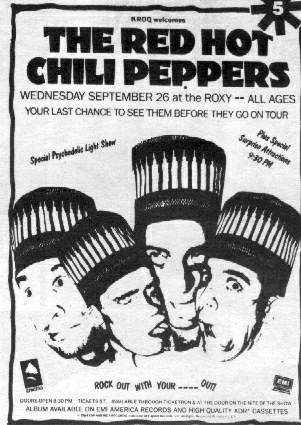
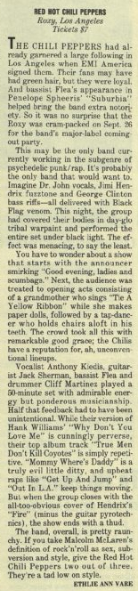

# Info

## Setlist

1. Why Don't You Love Me (Hank Williams)
2. True Men Don't Kill Coyotes
3. Mommy Where's Daddy?
4. Get Up and Jump
5. Out in L.A. 
6. Fire (Jimi Hendrix)
6. Baby Appeal
  SETLIST INCOMPLETE

## Notes

**Other Acts**: -

## Media 

  
Pictures

  
  

## Line Up

* Anthony Kiedis
* Flea
* Jack Sherman
* Cliff Martinez

## Recordings

## Links

## Reviews

> Ethlie Ann Vare, Billboard:
The Chili Peppers had already garnered a large following in Los Angeles when EMI America signed them. Their fans may have had green hair, but they were loyal. And bassist Flea’s appearance in Penelope Spheeris’ “Suburbia” helped bring the band extra notoriety. So it was no surprise that the Boxy was cram-packed on Sept. 26 for the band’s major-label coming-out party.
This may be the only band currently working in the subgenre of psychedelic punk/rap. It’s probably the only band that would want to. Imagine Dr. John vocals, Jimi Hendrix fuzztone and George Clinton bass riffs—all delivered with Black Flag venom. This night, the group had covered their bodies in day-glo tribal warpaint and performed the entire set under black light. The effect was menacing, to say the least.
You have to wonder about a show that starts with the announcer smirking “Good evening, ladies and scumbags.” Next, the audience was treated to opening acts consisting of a grandmother who sings “Tie A Yellow Ribbon” while she makes paper dolls, followed by a tap-dancer who holds chairs aloft in his teeth. The crowd took all this with remarkable good grace; the Chilis have a reputation for, ah, unconventional lineups.
Vocalist Anthony Kiedis, guitarist Jack Sherman, bassist Flea and drummer Cliff Martinez played a 50-minute set with admirable energy but ponderous musicianship. Half that feedback had to have been unintentional. While their version of Hank Williams’ “Why Don’t You Love Me” is cunningly perverse, their top album track “True Men Don’t Kill Coyotes” is simply repetitive. “Mommy Where’s Daddy” is a truly evil little ditty, and upbeat raps like “Get Up And Jump” and “Out In L.A.” keep things moving. But when the group closes with the all-too-obvious cover of Hendrix’s “Fire” (minus the guitar pyrotechnics), the show ends with a thud.
The band, overall, is pretty raunchy. If you take Malcolm McLaren’s definition of rock’n’roll as sex, sub-version and style, give the Red Hot Chili Peppers two out of three. They’re a tad low on style.