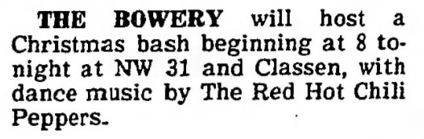

# Info

## Setlist

1. Out in L.A.
2. Bone
3. Buckle Down
4. Baby Appeal
5. Oom Chucka Willy
6. True Men Don't Kill Coyotes
7. Why Don't You Love Me (Hank Williams)
8. Sex Rap
9. Green Heaven
10. Police Helicopter
11. Nevermind tease
12. Get Up and Jump
13. Owner of a Lonely Heart tease ([Yes](https://en.wikipedia.org/wiki/Yes_(band)))
14. Battleship
15. Mommy Where's Daddy?
16. Fire (Jimi Hendrix)
17. You Always Sing the Same
18. Blackeyed Blonde

## Notes

**Other Acts**: -

## Media 

  
Pictures

  

## Line Up

* Anthony Kiedis
* Flea
* Jack Sherman
* Cliff Martinez

## Recordings

* AUD #1 audience audio: unknown mic > unknown recorder ANA(x) > FLAC recorded by unknown

## Links