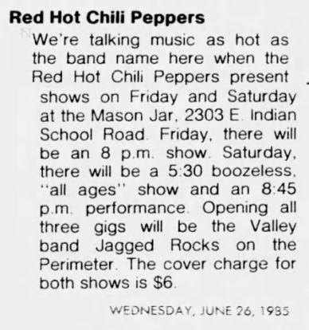

# Info

## Setlist

1. Out in L.A.
2. Jungle Man
3. Blackeyed Blonde
4. Green Heaven
5. Police Helicopter
6. Sex Rap
7. You Always Sing the Same
8. True Men Don't Kill Coyotes
9. Thirty Dirty Birds
10. Millionaires Against Hunger
11. Battleship
12. Lovin' and Touchin'
13. Catholic School Girls Rule
14. Nevermind
 ENCORE BREAK
15. Mommy Where's Daddy?
16. Fire (Jimi Hendrix)
 ENCORE BREAK
17. Get Up and Jump
18. Baby Appeal
19. Freaky Styley

## Notes

**Support**: Jagged Rocks on the Perimeter

## Media 

  
Pictures

  

## Line Up

* Anthony Kiedis
* Flea
* Hillel Slovak
* Cliff Martinez

## Recordings

* AUD #1 audience audio: unknown mic > unknown recorder ANA(1) > FLAC recorded by unknownThis recording has been circulating for years misdated to October 1985 but the band didn't play in Phoenix that month, a December 1985 clipping confirms. However, it's still uncertain to which of the three preformances at the Mason Jar in June 1985 belongs.

## Links