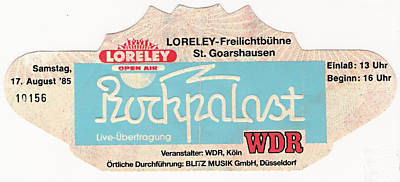
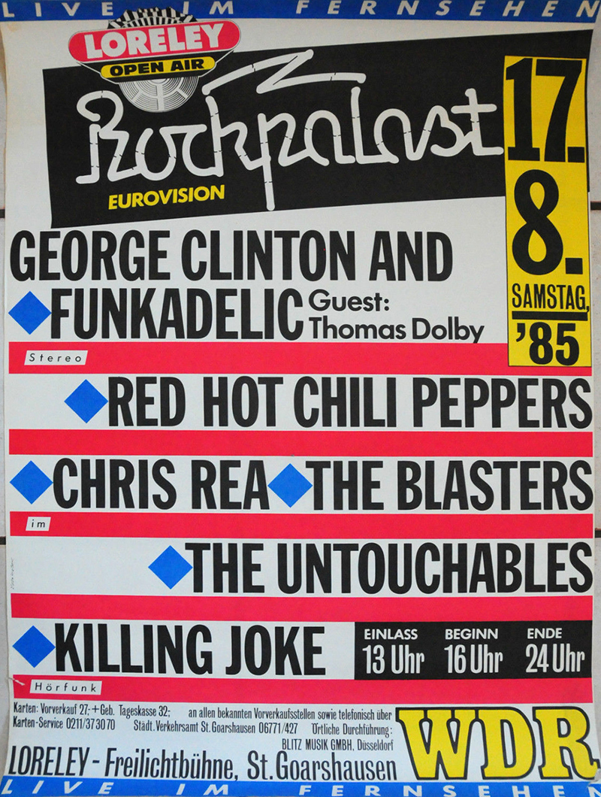

# Info

## Setlist

1. Intro Jam
2. Out in L.A.
3. Jungle Man
4. Buckle Down
5. Green Heaven
6. Hollywood (Africa)
7. Stranded
8. Blackeyed Blonde
9. Baby Appeal
10. You Always Sing the Same
11. True Men Don't Kill Coyotes
12. Get Up and Jump
13. Battleship
 ENCORE BREAK
14. Heemi Lheemy
15. Fire (Jimi Hendrix)

## Notes

> The first show ever outside the United States. George Clinton joined the band for "Hollywood (Africa)".

**Support**: -

## Media 

  
Pictures

    
  

## Line Up

* Anthony Kiedis
* Flea
* Hillel Slovak
* Cliff Martinez

## Recordings

* PRO #1 professional video: soundboard > unknown TV > DVD Originally broadcasted by German TV network "WDR", however there are various transfers from different sources circulating, the best one being from a digital "Europe2TV" broadcast.

## Links