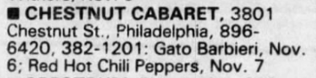

# Info

## Setlist

## Notes

**Support**: -

## Media 

  
Pictures

  

## Line Up

* Anthony Kiedis
* Flea
* Hillel Slovak
* Cliff Martinez

## Recordings

## Reviews
> **Ken Tucker, Philadelphia Inquirer**:
One of the more annoying rock acts to come down the pike, the Red Hot Chili Peppers are four white boys from Hollywood who try to act like East Coast black boys, performing rap songs in exaggerated accents that are at best condescending and at worst racist.
  Performing, if that's the word, at the Chestnut Cabaret Thursday night, the Peppers found a sympathetic, if rather sparse, audience among Penn locals, who seemed to enjoy the stiff, clunky rhythms slammed out by the Peppers as well as the group's self-consciously vulgar behavior. Don't get me wrong; when it comes to pop culture, I love vulgarity, but I like mine with some originality. These goons act as if they'd just seen John Belushi in Animal House for the first time.
  Honestly, I wouldn't have bothered with the Red Hot Chili Peppers had their latest album, Freaky Styley (EMI America), not been produced by George Clinton, the great, innovative funk musician. Having now seen the Peppers in action, I can only assume that Clinton took on the task of trying to make this bunch sound better as a charitable effort: Pepper Aid.

## Links