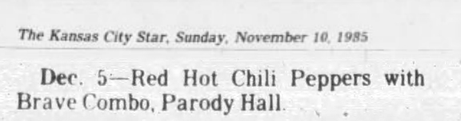

# Info

## Setlist

1. Freaky Styley
2. Yertle the Turtle
3. Sex Rap
4. True Men Don't Kill Coyotes
5. Get Up and Jump
6. Lovin' and Touchin'
 **SETLIST INCOMPLETE**

## Notes

**Support**: Brave Combo

## Media 

  
Pictures

  

## Line Up

* Anthony Kiedis
* Flea
* Hillel Slovak
* Cliff Martinez

## Recordings

## Reviews

> Brian McTavish, The Kansas City Star:
The Red Hot Chili Peppers are a mysterious and partying lot, as they proved to about 350 people Thursday night at Parody Hall.
Brash in delivery, subversive in tone and absolutely funky all over, these four lively guys from Hollywood acted as if they believed in the adage "free to be you and me" as practiced by the giant shark in "Jaws".
The band members -all shirt-less- felt uninhibited enough on stage to spit and belch or don such out-of-the-ordinary headgear as a witch's hat or a welder's mask. Practically without exception, they stuck to one wild, repetitious groove that packed the dance floor for the lenght of the band's roughly one-hour set.
Although Anthony Kiedis' street-rap vocalizing was almost impossible to understand, it sounded as if it had been inspired by his arch-badness, James Brown. Mr. Kiedis, who wore a short skirt that looked like the American flag, grunted and gave plenty of throaty "uh-huhs" in what could politely be described as a suggestive delivery.
His head motions implied that he mistook his cranium for a hammer and the air around him as one big nail to pound. The other Red Hots followed suit in expressing their own leap-off-the-diving-board physicality.
Almost purely rhytmic original songs such as "Freaky Styley", "Yerthe the Turtle", "Sex Rap", "True Men Don't Kill Coyotes" and the aptly titled "Get Up and Jump" showed that the band was expert (thanks in great part to a muscular rhythm section) when it came to inducing abandon in itself and the audience.
Only on "Lovin' and Touchin'" which featured Mr. Kiedis actually singing in a fragile ballad style, did the Red Hots break out of their get-funky-or-die routine. Yet the band was entertaining -if after a while predictable- with its primitive and often foul-mouthed antics.
Denton, Texas, polka-rockers Brave Combo offered a more musical opening set that was pretty crazy, too, although it came through in the material more than the group's behavior. The four members interweaved elements of Tin Pan Alley, Latin and rock music with polka extracts to make patrons think as well as move.

## Links