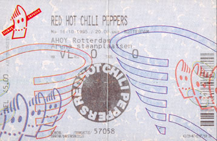
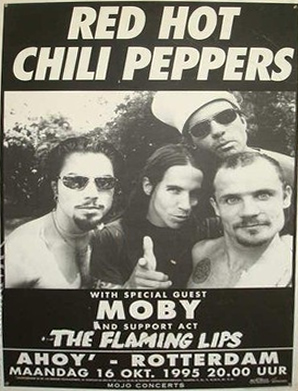
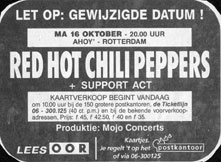

# Info

## Setlist

1. Grand Pappy du Plenty part of
2. Give It Away
3. Suck My Kiss
4. Aeroplane
5. Warped
6. Walkabout
7. Come as You Are tease
8. Backwoods
9. My Friends
10. Sweet Home Alabama tease
11. Coffee Shop
12. Sound and Vision part of
13. Higher Ground
14. Hey Joe tease
15. Transcending
16. Pea
17. One Big Mob
18. Under the Bridge
19. Me and My Friends
 ENCORE BREAK
20. Deep Kick
21. Suffragette City

## Notes

**Support**: The Flaming Lips, Moby

## Media 

  
Pictures

  
  
  

## Line Up

* Anthony Kiedis
* Flea
* Dave Navarro
* Chad Smith

### Additonal Musicians:
* Rob Rule
* Rain Phoenix

## Recordings

* SBD #1 soundboard audio: soundboard > unknown recorder FM > ANA(M) > FLAC Broadcasted by Kink radio.
* SBD #2a soundboard audio: soundboard > unknown recorder "Aeroplane" CD > FLAC "Backwoods", "Transcending" and "Me And My Friends" were officially released on the regular Aeroplane CD single.  
* SBD #2b soundboard audio: soundboard > unknown recorder "Aeroplane" CD > FLAC "Suck My Kiss" and "Suffragette City" were officially released on the limited edition Aeroplane CD single.

# Links

* [Offical Playlist from RHCP Youtube channel](https://youtube.com/playlist?list=OLAK5uy_nd0mSeXRA2kUbM-D_eshC-qIYUIXas5rs)
* [Rotterdam Ahoy](https://www.ahoy.nl/en)