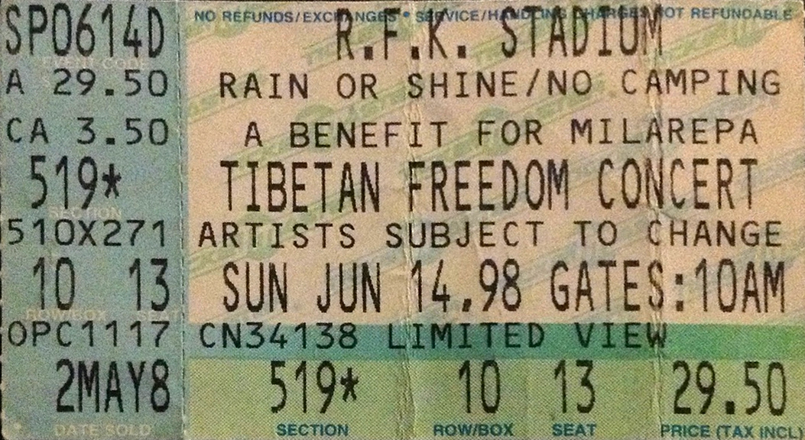

# Info

## Setlist

1. Give It Away
2. Under the Bridge
3. The Power of Equality

## Notes

> Pearl Jam cut their set 15 minutes short and handed off the stage to the band for a surprise 3-song appeareance (they weren't officially on the bill).

**Attendance**: 59,340 / 59,340 (100%)

## Media 

  
Pictures

  

## Line Up

* Anthony Kiedis
* Flea
* John Frusciante
* Chad Smith

## Recordings

* AUD #1 audience audio: AKG 451 > AMSBPR2 > Sony TCD-D7 DAT(M) > FLAC recorded by Todd Guite (aka guite917)
* AUD #2 audience audio: unknown mic > unknown recorder ? > FLAC recorded by unknown
* AMT #1 amateur video: built-in > unknown camera Hi8(m) > ? > MP4 recorded by markit aneight One of the shots used in the mix. Surfaced on YouTube in July 2015.
* MIX #1 mixed video: built-in > unknown cameras VHS(X) > DVD Mix of three amateur shots standing next to each other.

## Links
