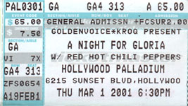

# Info

## Setlist

1. Around the World
2. You're Gonna Get Yours tease (Public Enemy)
3. Give It Away
4. Your Pussy's Glued to a Building on Fire JOHN
5. Scar Tissue
6. My Lovely Man
7. If You Have to Ask
8. Skinny Sweaty Man
9. Otherside
10. Pretty Little Ditty
11. Parallel Universe
12. Hello, Hello, I'm Back Again part of JOHN (Gary Glitter)
13. I Could Have Lied
14. Californication
15. London Calling tease
16. Right on Time
17. Under the Bridge
18. Me and My Friends
 ENCORE BREAK
19. Soul to Squeeze
20. Search and Destroy (Iggy Pop & The Stooges)

## Notes

> Benefit event called "A Night for Gloria" for Gloria Scott, a drug councilor fighting cancer.

**Support**: Paul Oakenfold, Thelonious Monster, Neil Young & Crazy Horse

## Media 

  
Pictures

  
  <!---->

## Line Up

| Vocals           | Bass          | Guitar          | Drums         |
| :-------------:  |:-------------:| --------------- |:-------------:|
| Anthony Kiedis   | Flea          | John Frusciante | Chad Smith    |

## Recordings

* AUD #1 audience audio: unknown mic > unknown recorder DAT(M) > FLAC recorded by unknown"Me and My Friends" cuts out, missing "Soul to Squeeze" and "Search and Destroy".

## Links