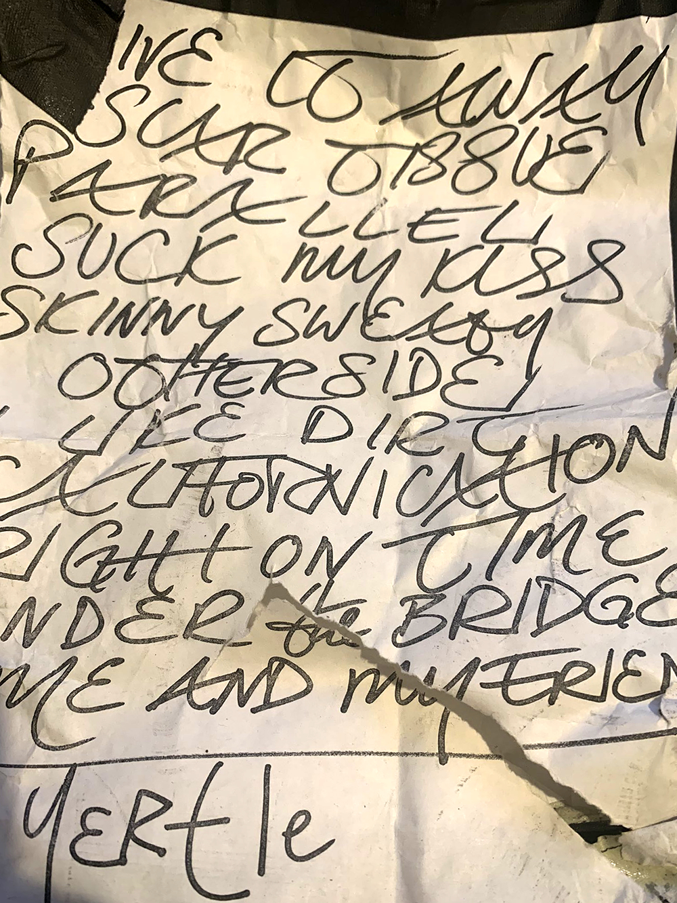

# Info

## Setlist

1. Give It Away
2. Your Pussy's Glued to a Building on Fire JOHN
3. Scar Tissue
4. Parallel Universe
5. Suck My Kiss
6. Skinny Sweaty Man
7. Pea
8. Otherside
9. I Like Dirt
10. Californication
11. London Calling tease (The Clash)
12. Right on Time
13. Forming II JOHN
14. Under the Bridge
15. Me and My Friends
 ENCORE BREAK
16. Yertle the Turtle
17. Freaky Styley
18. Cosmic Slop tease  (Funkadelic)
19. Atomic Dog tease (George Clinton)
20. Cholly (Funk Get Ready to Roll!) tease (Funkadelic)
21. Not Great Men tease (Gang of Four)
22. History Lesson – Part II tease (Minutemen)

## Notes

> Benefit gig for the Robin Hood foundation.

## Media 

  
Pictures

  
  <!---->

## Line Up

| Vocals           | Bass          | Guitar          | Drums         |
| :-------------:  |:-------------:| --------------- |:-------------:|
| Anthony Kiedis   | Flea          | John Frusciante | Chad Smith    |

## Recordings

* AUD #1 audience audio: unknown mic > unknown recorder DAT(M) > FLAC recorded by unknown 
* AUD #2 audience audio: unknown mic > unknown recorder MD(M) > FLAC recorded by KIST9017 NOT CIRCULATING

## Links