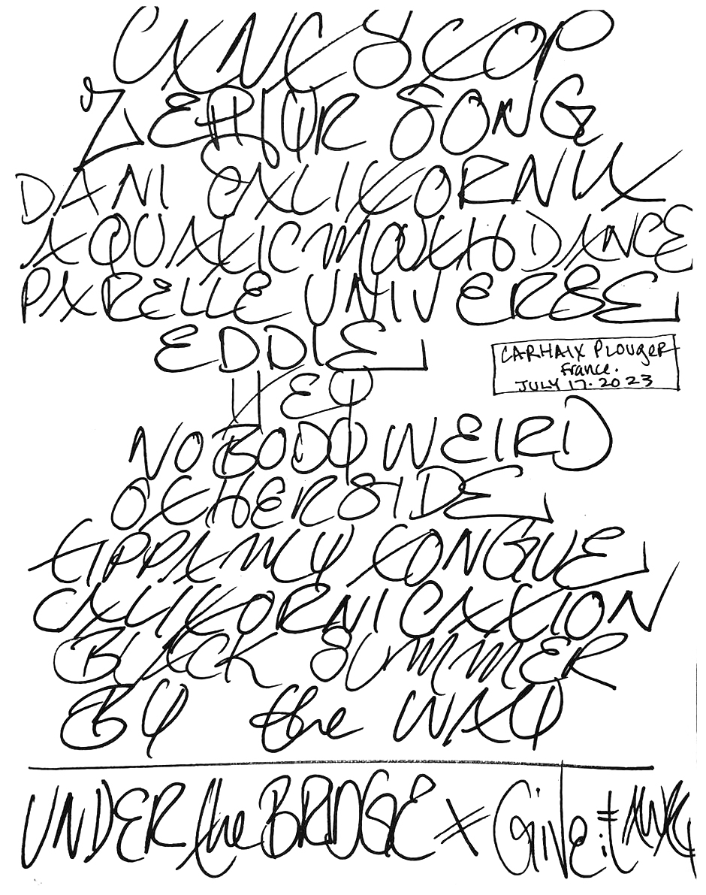
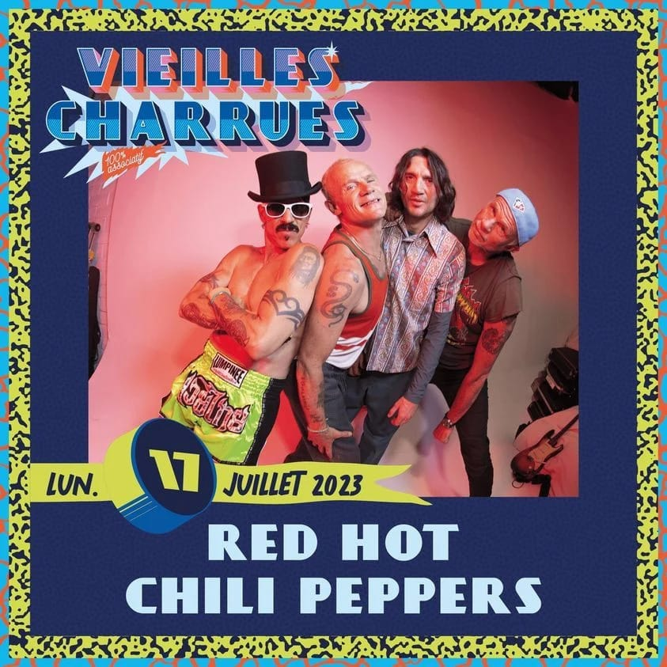

# Info

## Setlist

1. Intro Jam
2. Can't Stop
3. The Zephyr Song
4. Dani California
5. Sex Rap (tease)
6. Aquatic Mouth Dance
7. Dreamboy/Dreamgirl (Cynthia & Johnny O. cover by John Frusciante)
8. Parallel Universe
9. Eddie
10. Hey
11. Nobody Weird Like Me
12. Otherside
13. Tippa My Tongue
14. Californication
15. Black Summer
16. By the Way
 ENCORE BREAK
17. Under the Bridge
18. Give It Away

## Notes

**Other Acts**: [Skip the Use](https://skiptheuse.fr)

## Media

  
Pictures

  
  

## Line Up

* Anthony Kiedis
* Flea
* John Frusciante
* Chad Smith

## Recordings

* AUD #1 audience audio: Church Audio CA-11 > CA UBB > Zoom H1WAV > FLAC recorded by CrazyToaster

## Links

* [Vieilles Charrues Festival site](https://www.vieillescharrues.asso.fr)
